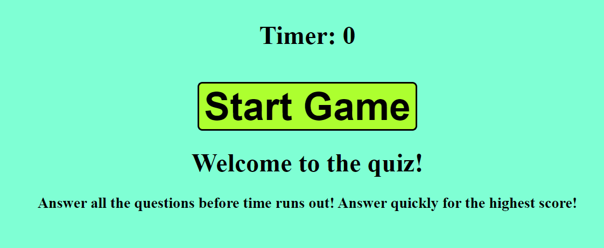
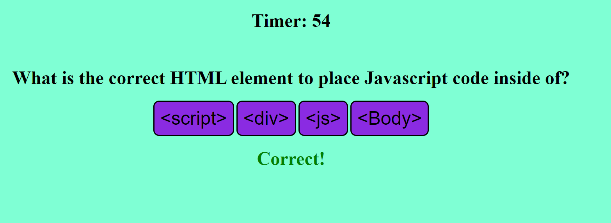
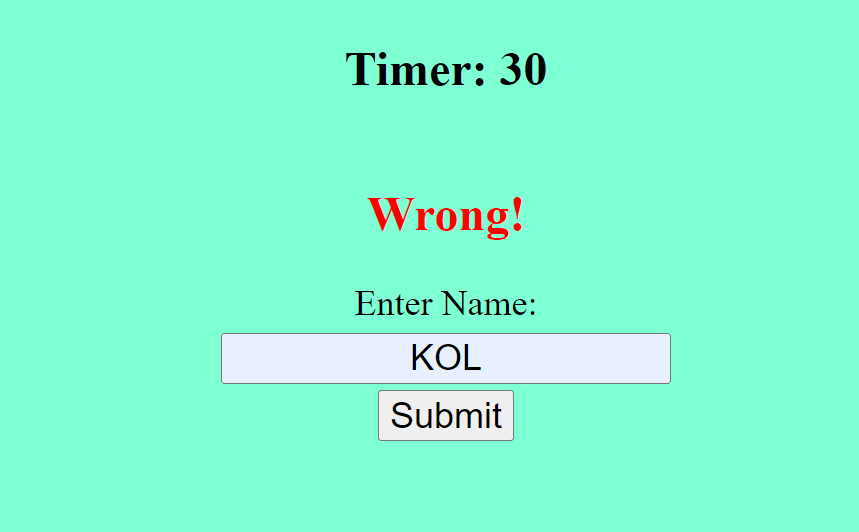

# code_quiz
An in-browser quiz game with multiple choice questions and a scoreboard.

## Author
- Karl  Linfeldt

## Deployed App
-[Live Page](https://karlol82.github.io/code_quiz/index.html)
-[Github Repo](https://github.com/KarlOL82/code_quiz)

## User Story
As a bootcamp student,
I want to create a quiz game to be played in the browser
So that I can challenge my peers and compare their knowledge to my own.

## Overview
The purpose of this project is to create dynamic Javascript content in the browser in the form of an interactive quiz game.
The game begins when the user clicks a button which starts a timer and displays the first question with four multiple choice answers. If the user chooses the correct answer, the next question is immediately displayed and the user is notified that their answer is correct. If, however, the user chooses incorrectly, the timer is decremented by 15 seconds in addition to the next question being displayed. 
The game is over when either the timer expires or all of the questions have been answered. Upon getting through all of the questions, the remaining time becomes the user's score and they are prompted to enter their name.  The name and score are saved to the browser via local storage and displayed on a separate page. The user can then continue to play the game and add their name to the scoreboard or clear the saved scores and begin anew.

## Built with
-Javascript
-CSS
-HTML

## Takeaways

This was a very challenging and time-consuming project for me as a new developer. There was a great deal of trial and error which ended up being priceless and much needed practice!
I can see how Javascript is such a powerful tool in web development as I have learned to do a great deal with it already and I haven't even scratched the surface of what can be achieved. I'm excited to implement the tools from this project in other work going forward as I feel much more comfortable with the syntax and logic than when I began.

## Photos

